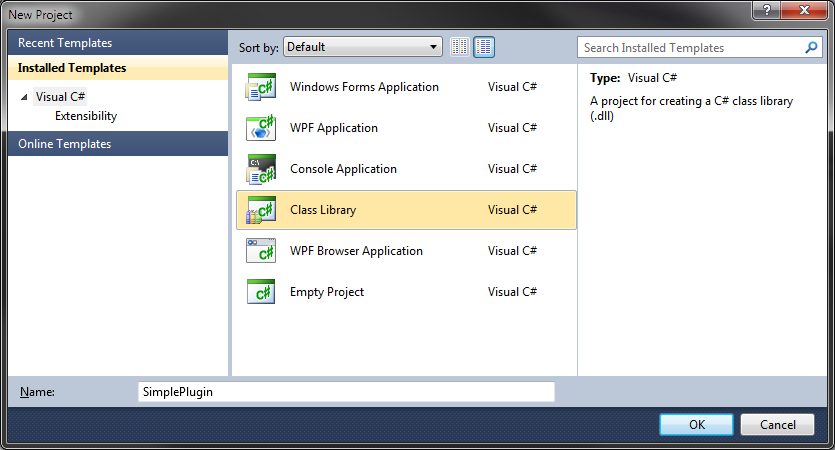
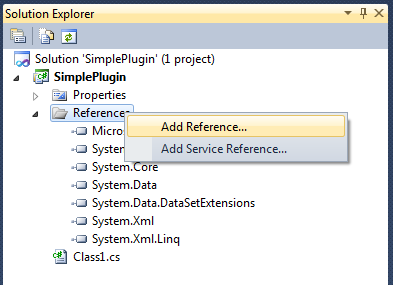
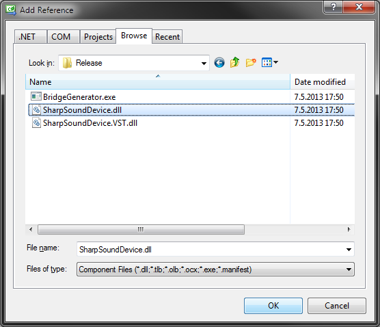
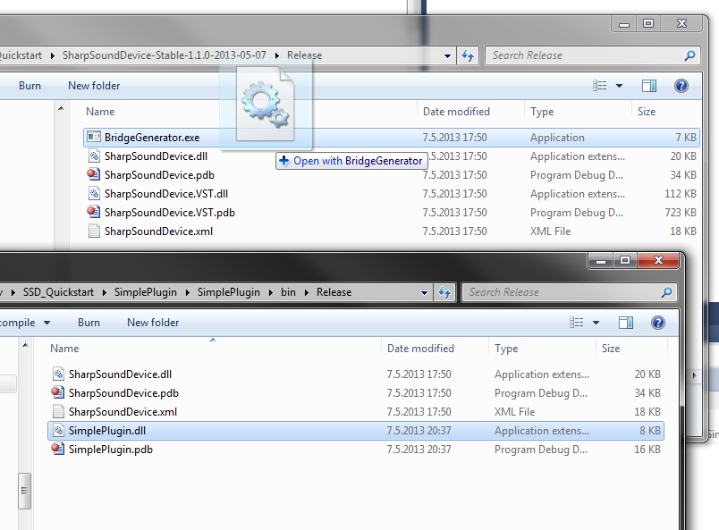
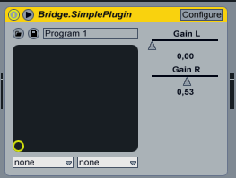
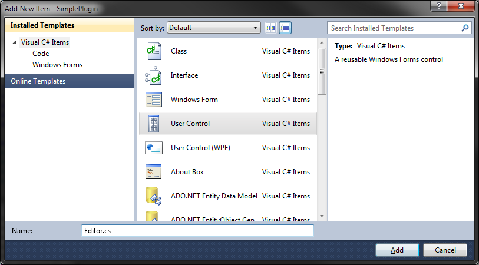
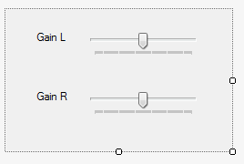
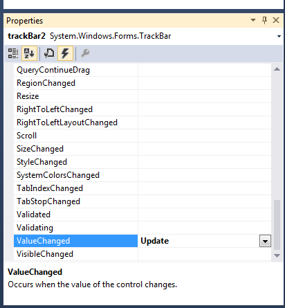
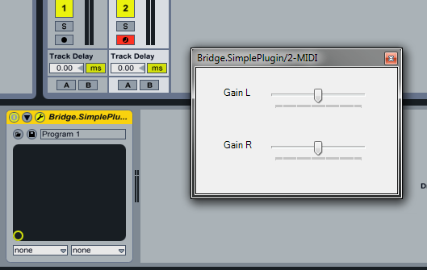

# Quickstart Guide

This quickstart guide shows how to create a very simple SharpSoundDevice plugin with Visual Studio 2010 Express.

[You can download the demo projects here]()

## 1. Download the latest version

You can find compiled builds in the [Builds directory]() on Github. Get the latest stable version and extract it in a good location on your computer.

## 2. Start a new Project

Open Visual Studio and create a new Class Library Project.

## 3. Setup your references

Right click *References* and select *Add Reference*. Find the SharpSoundDevice.dll assembly and add it to your project.

## 4. Create a new class that implements IAudioDevice

IAudioDevice is the main interface. It is the interface that the host / plugin bridge uses to interact with your plugin. Your class needs to implement the methods and properties defined by the interface (it will warn you with a compile error if you don't).

### Demo 1a
*The following is code that implements a very simple gain control plugin. It has one stereo input, one stereo output, two parameters that control the volume of the left and right channels and a single program. This is **all** the code you need to compile.*

    using System;
    using System.Collections.Generic;
    using System.Linq;
    using System.Text;
    using SharpSoundDevice;
    using System.Globalization;

    namespace SimplePlugin
    {
	    public class Plugin : IAudioDevice
	    {
		    private DeviceInfo DevInfo;

		    public int CurrentProgram { get; private set; }
		    public DeviceInfo DeviceInfo { get { return DevInfo; } }
		    public IHostInfo HostInfo { get; set; }
		    public Parameter[] ParameterInfo { get; private set; }
		    public Port[] PortInfo { get; private set; }

		    public Plugin()
		    {
			    DevInfo = new DeviceInfo();
			    DevInfo.Developer = "Valdemar Erlingsson";
			    DevInfo.DeviceID = "Valdemar Erlingsson - SimplePlugin";
			    DevInfo.EditorHeight = 0;
			    DevInfo.EditorWidth = 0;
			    DevInfo.HasEditor = false;
			    DevInfo.Name = "SimplePlugin";
			    DevInfo.ProgramCount = 1;
			    DevInfo.Type = DeviceType.Effect;
			    DevInfo.Version = 1000;
			    DevInfo.VstId = DeviceUtilities.GenerateIntegerId(DevInfo.DeviceID);

			    ParameterInfo = new Parameter[2]
			    {
				    new Parameter() { Display = "1.0", Index = 0, Name = "Gain L", Steps = 0, Value = 1.0 },
				    new Parameter() { Display = "1.0", Index = 1, Name = "Gain R", Steps = 0, Value = 1.0 }
			    };

			    PortInfo = new Port[2]
			    {
				    new Port() { Direction = PortDirection.Input, Name = "Stereo Input", NumberOfChannels = 2 }, 
				    new Port() { Direction = PortDirection.Output, Name = "Stereo Output", NumberOfChannels = 2 }
			    };
		    }

		    public void InitializeDevice() { }
		    public void DisposeDevice() { }
		    public void Start() { }
		    public void Stop() { }
		    public void OpenEditor(IntPtr parentWindow) { }
		    public void CloseEditor() { }
		    public void HostChanged() { }

		    public void ProcessSample(double[][] input, double[][] output, uint bufferSize)
		    {
			    var gainL = ParameterInfo[0].Value;
			    var gainR = ParameterInfo[1].Value;

			    for (int i = 0; i < bufferSize; i++)
			    {
				    output[0][i] = input[0][i] * gainL;
				    output[1][i] = input[1][i] * gainR;
			    }
		    }

		    public void SendEvent(Event ev)
		    {
			    if (ev.Type == EventType.Parameter && ev.EventIndex < ParameterInfo.Length)
			    {
				    SetParam(ev.EventIndex, (double)ev.Data);
			    }
		    }

		    public void SetParam(int index, double value)
		    {
			    ParameterInfo[index].Value = value;
			    ParameterInfo[index].Display = String.Format("{0:0.00}", value);
		    }

		    public Program GetProgramData(int index)
		    {
			    string programText = String.Format(CultureInfo.InvariantCulture, 
				    "{0:0.00}, {1:0.00}", ParameterInfo[0].Value, ParameterInfo[1].Value);
			    byte[] programData = Encoding.ASCII.GetBytes(programText);

			    var program = new Program();
			    program.Name = "Program 1";
			    program.Data = programData;
			    return program;
		    }

		    public void SetProgramData(Program program, int index)
		    {
			    string programText = Encoding.ASCII.GetString(program.Data);
			    double[] values = programText.Split(',').Select(x => 
				    Convert.ToDouble(x, CultureInfo.InvariantCulture)).ToArray();
			
			    ParameterInfo[0].Value = values[0];
			    ParameterInfo[1].Value = values[1];
			    ParameterInfo[0].Display = String.Format("{0:0.00}", values[0]);
			    ParameterInfo[1].Display = String.Format("{0:0.00}", values[1]);
		    }	
	    }
    }

### Demo 1a - Properties

The plugin declares all the properties required by IAudioDevice.

### Demo 1a - Constructor

Most of the work occurs inside the constructor. This is where we set all the device info variables, like the name, the author of the plugin, the plugin ID, plugin type, etc...

Next we need to create the parameters. We assign a new Parameter array to the ParameterInfo property. It contains two parameters, named Gain L and Gain R. They have an initial value of 1.0 (which mean full gain).

Finally we need to create the ports. Since this is a stereo-in stereo-out plugin we create two ports, one that has Direction = PortDirection.Input and the other with Direction = PortDirection.Output. They both have 2 channels.

### Demo 1a - Empty methods

Although our plugin does not have an editor, does not perform any tasks on Start, Stop, etc... we still need to declare these methods because the interface requires them.

### Demo 1a - ProcessSample

ProcessSample is where all the work happens. It simply loops through all the samples in the buffers, multiplies the input signal with the gain amount and assigns the value to the output. Since we know our plugin has one stereo input and one stereo output, we know total number of channels is 2 inputs and 2 outputs.

### Demo 1a - SendEvent and SetParam

SendEvent is part of the IAudioDevice interface, it receives events from the host. In this case, we're only interested in Parameter events.

### Demo 1a - GetProgramData and SetProgramData

Plugins are required to implement these methods. They are used to save and restore the plugin state (preset/patch). In this case they perform a simple string serialization and return the output as an array of bytes.

While implementing these methods can require you to write a bit of boilerplate code, the benefit is the fact that plugins are not required to follow any specific format, so you're free to handle this however you want.

If your plugin is a simple, parameter-based plugin, you can use the methods in DeviceUtilities to serialize and deserialize your parameters 

## 5. Build the Project

Build the project by right clicking it in the Solution Explorer and click Build. Make sure there are no build errors.

You should now have a .NET assembly in the bin\Release directory under your project.

Now we need to get that .NET dll to interact with a VST host. For that, we use the Bridge Generator.

## 6. Create a new bridge DLL

To generate the bridge library, simply drag your freshly compiled assembly and drop it on the BridgeGenerator.exe application (it comes with the SharpSoundDevice release your downloaded in step 1). Note that you can also run BridgeGenerator from the command line.

The Bridge Generator creates a new dll, called Bridge.SimplePlugin.dll

This Bridge DLL contains both native (C++) code, to interact with the VST host, as well as .NET code to interact with your plugin. To create the file, the BridgeGenerator simply takes a template dll (SharpSoundDevice.VST.dll) and does a binary patch to replace a placeholder value inside the dll file with the name of your .NET assembly.

## 7. Deploy and load your new plugin

That's it, you're done! All you have to do is copy all the DLL files to your VST plugin directory (e.g. c:\Program Files (x86)\Steinberg\VST). You need to copy the following files:

* Bridge.SimplePlugin.dll (you can rename this file if you want to)
* SharpSoundDevice.dll
* SimplePlugin.dll

Now, start your VST host and try out your new plugin!

## 8. Troubleshooting & Debugging

The plugin bridge writes a log file and logs every step of the assembly loading process. It is located in the same directory as the Bridge.SimplePlugin.dll file, with an extension of "*.log*"

**Example log output:**

	<2013-05-07 20:49:00.185 > 
	<2013-05-07 20:49:00.185 > SharpSoundDevice Version: v2.0.50727
	<2013-05-07 20:49:00.185 > SharpSoundDevice Configuration: Release
	<2013-05-07 20:49:00.186 > Starting new plugin instance, ID: 1008
	<2013-05-07 20:49:00.186 > Assembly name: SimplePlugin.dll
	<2013-05-07 20:49:00.186 > Attempting to load assembly SimplePlugin.dll
	<2013-05-07 20:49:00.186 > Alternative search path is E:\VstPlugins\plugin
	<2013-05-07 20:49:00.186 > Searching for E:\VstPlugins\plugin\SimplePlugin.dll
	<2013-05-07 20:49:00.187 > Checking if assembly is already loaded
	<2013-05-07 20:49:00.187 > Assembly is already loaded, returning a reference
	<2013-05-07 20:49:00.187 > Searching for classes in assembly
	<2013-05-07 20:49:00.187 > Number of classes: 1
	<2013-05-07 20:49:00.187 > Calling parameterless constructor for class
	<2013-05-07 20:49:00.188 > Attempting to cast new object to IAudioDevice
	<2013-05-07 20:49:00.188 > Object successfully loaded
	<2013-05-07 20:49:00.188 > SharpSoundDevice.VST Version: v4.0.30319
	<2013-05-07 20:49:00.188 > SharpSoundDevice.VST Configuration: Release

If your plugin won't load for some reason, reading the log output should give you a good idea of what is not working.

Uncaught exception that occur in your plugin will also be logged in this file:

	<2013-05-07 23:34:11.786 > Object successfully loaded
	<2013-05-07 23:34:11.786 > SharpSoundDevice.VST Version: v4.0.30319
	<2013-05-07 23:34:11.786 > SharpSoundDevice.VST Configuration: Release
	<2013-05-07 23:34:11.801 > Index was outside the bounds of the array.
	   at SimpleSynth.Plugin.GetProgramData(Int32 index)
	   at AudioDevice.GetProgramData(AudioDevice* , Int32 index)

Unfortunately, it is near impossible to debug plugins using Visual Studio 2010 Express. However, developers with a full edition of Visual Studio can attach the debugger to the (native) VST host and debug the .NET code while it is running.

## 9. Creating a User Interface

Now, let's try making a simple WinForms editor. You can also use WPF to build user interfaces, but the process is slightly more complicated (you need to add several references to your project and change some project settings).

To create the editor, right click the project and select Add->New Item. Add a new User Control and name it Editor.cs

Visual Studio should automatically add the required references to your project (e.g. System.Windows.Forms).

Now, slap together a simple control for your plugin. Something like this will suffice:

Now, let's write the code for the editor. It's not very complex, all it needs to do is update the plugin when we move the TrackBars, and expose a method that the plugin can use to update the TrackBars when it receives events from the host.

### Demo 1b

    namespace SimplePlugin
    {
	    public partial class Editor : UserControl
	    {
		    public Plugin Plugin;

		    public Editor(Plugin plugin)
		    {
			    Plugin = plugin;
			    InitializeComponent();
			    Reload();
		    }

		    public void Reload()
		    {
			    var gainL = (int)(Plugin.ParameterInfo[0].Value * 100);
			    var gainR = (int)(Plugin.ParameterInfo[1].Value * 100);

			    if(gainL != trackBar1.Value)
				    trackBar1.Value = gainL;

			    if (gainR != trackBar2.Value)
				    trackBar2.Value = gainR;
		    }

		    private void Update(object sender, EventArgs e)
		    {
			    var gainL = trackBar1.Value / 100.0;
			    var gainR = trackBar2.Value / 100.0;
			    var evL = new Event() { Data = gainL, EventIndex = 0, Type = EventType.Parameter };
			    var evR = new Event() { Data = gainR, EventIndex = 1, Type = EventType.Parameter };

			    Plugin.SetParam(0, gainL);
			    Plugin.SetParam(1, gainR);
			    Plugin.HostInfo.SendEvent(Plugin, evL);
			    Plugin.HostInfo.SendEvent(Plugin, evR);
		    }
	    }
    }

But there's one trick. Notice the last two lines of code. They're needed to let the *host* know when we update parameters through the editor. Otherwise, the host won't be able to record automation.

You need to connect the *ValueChanged* event of the TrackBars to the Update method.

### Plugin Changes

In the Plugin class we need to make a few changes to take advantage of the editor:

**Demo 1b - Change the DeviceInfo:**

	DevInfo.EditorHeight = 154;
	DevInfo.EditorWidth = 247;
	DevInfo.HasEditor = true;

**Demo 1b - Add a field for the Editor and implement the OpenEditor() method**:

	Editor Editor;

	public void OpenEditor(IntPtr parentWindow) 
	{
		Editor = new Editor(this);
		DeviceUtilities.DockWinFormsPanel(Editor, parentWindow);
	}

**Demo 1b - Reload the TrackBar values when we receive an event:**

	public void SendEvent(Event ev)
	{
		if (ev.Type == EventType.Parameter && ev.EventIndex < ParameterInfo.Length)
		{
			SetParam(ev.EventIndex, (double)ev.Data);
			if (Editor != null)
				Editor.Reload();
		}
	}

And now we're ready to test our new editor!

### Common Gotchas

Make sure you don't end up with a circular loop between the editor and the plugin, where the editor updates the plugin, and the plugin reloads the editor, which triggers another plugin update and so on...

## 10. MIDI sine-wave synthesizer

The following is a simple sine-wave synthesizer that responds to MIDI note-on and note-off messages. It's monophonic and has one paramater that controls the semitone offset.

### Demo 2

    using System;
    using System.Collections.Generic;
    using System.Linq;
    using System.Text;
    using SharpSoundDevice;
    using System.Globalization;

    namespace SimpleSynth
    {
	    public class Plugin : IAudioDevice
	    {
		    private DeviceInfo DevInfo;
		    private int Semitone;
		    private int Pitch;
		    private double Gate;
		    private double Phase;
		    private double Samplerate;

		    public int CurrentProgram { get; private set; }
		    public DeviceInfo DeviceInfo { get { return DevInfo; } }
		    public IHostInfo HostInfo { get; set; }
		    public Parameter[] ParameterInfo { get; private set; }
		    public Port[] PortInfo { get; private set; }

		    public Plugin()
		    {
			    Samplerate = 48000;
			    DevInfo = new DeviceInfo();
			    DevInfo.Developer = "Valdemar Erlingsson";
			    DevInfo.DeviceID = "Valdemar Erlingsson - SimpleSynth";
			    DevInfo.EditorHeight = 0;
			    DevInfo.EditorWidth = 0;
			    DevInfo.HasEditor = false;
			    DevInfo.Name = "SimpleSynth";
			    DevInfo.ProgramCount = 1;
			    DevInfo.Type = DeviceType.Generator;
			    DevInfo.Version = 1000;
			    DevInfo.VstId = DeviceUtilities.GenerateIntegerId(DevInfo.DeviceID);

			    ParameterInfo = new Parameter[1]
			    {
				    new Parameter() { Display = "0", Index = 0, Name = "Semitones", Steps = 25, Value = 0.5 }
			    };

			    PortInfo = new Port[1]
			    {
				    new Port() { Direction = PortDirection.Output, Name = "Stereo Output", NumberOfChannels = 2 }
			    };
		    }

		    public void InitializeDevice() { }
		    public void DisposeDevice() { }
		    public void Start() { }
		    public void Stop() { }
		    public void OpenEditor(IntPtr parentWindow) { }
		    public void CloseEditor() { }

		    public void HostChanged() 
		    {
			    Samplerate = HostInfo.SampleRate;
		    }

		    public void ProcessSample(double[][] input, double[][] output, uint bufferSize)
		    {
			    int note = Pitch + Semitone;
			    double frequency = 440 * Math.Pow(2, (note - 69) / 12.0);
			    var delta = frequency / Samplerate;

			    for (int i = 0; i < bufferSize; i++)
			    {
				    double val = Math.Sin(2 * Math.PI * Phase) * Gate;
				    output[0][i] = val;
				    output[1][i] = val;
				    Phase += delta;
			    }
		    }

		    public void SendEvent(Event ev)
		    {
			    if (ev.Type == EventType.Parameter && ev.EventIndex < ParameterInfo.Length)
			    {
				    Semitone = (int)Math.Round(((double)ev.Data - 0.5) * 24.0);

				    ParameterInfo[ev.EventIndex].Value = (double)ev.Data;
				    ParameterInfo[ev.EventIndex].Display = Semitone.ToString();
			    }
			    else if (ev.Type == EventType.Midi)
			    {
				    byte[] data = (byte[])ev.Data;
				    if ((data[0] & 0xF0) == 0x80) // 0x80 is midi note-off
				    {
					    Gate = 0.0;
				    }
				    else if ((data[0] & 0xF0) == 0x90) // 0x90 is midi note-on
				    {
					    Pitch = data[1];
					    Gate = data[2] / 255.0;
				    }
			    }
		    }

		    public Program GetProgramData(int index)
		    {
			    string programText = String.Format(CultureInfo.InvariantCulture,
				    "{0:0.00}", ParameterInfo[0].Value);
			    byte[] programData = Encoding.ASCII.GetBytes(programText);

			    var program = new Program();
			    program.Name = "Program 1";
			    program.Data = programData;
			    return program;
		    }

		    public void SetProgramData(Program program, int index)
		    {
			    string programText = Encoding.ASCII.GetString(program.Data);
			    double value = Convert.ToDouble(programText, CultureInfo.InvariantCulture);

			    Semitone = (int)Math.Round((value - 0.5) * 24.0);
			    ParameterInfo[0].Value = value;
			    ParameterInfo[0].Display = Semitone.ToString();
		    }
	    }
    }

The basic structure of this plugin is very similar to the previous example. I won't go into much detail about how ProcessSample works, but what might interest you is the SendEvent method.

When a plugin receives a Midi event the data contains raw midi messages. That means you need to know the Midi specification. [A good reference is here](http://home.roadrunner.com/~jgglatt/tech/midispec.htm)

## Documentation

[View the documentation]()

## Bug Reports and Feedback

Please use the Issue tracker on Github to report bugs or to provide feedback.

